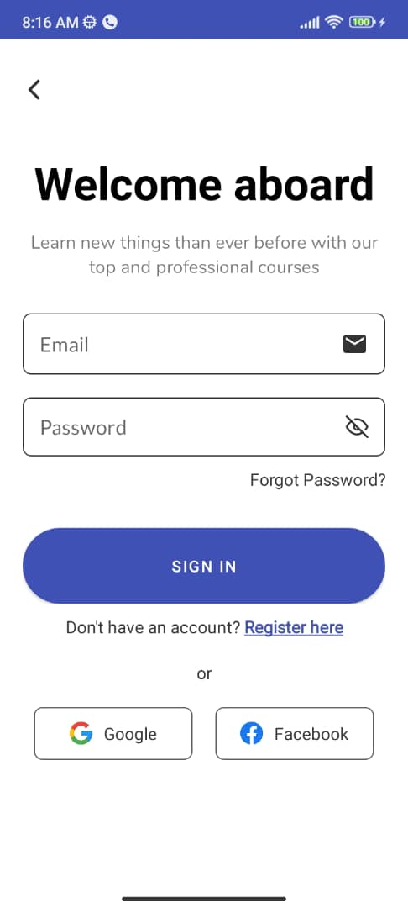
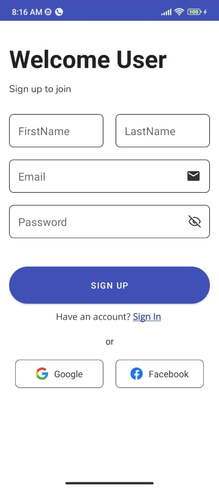

# CourseHub Mobile App

Welcome to the CourseHub Mobile App! This application allows users to browse, search for, and book courses. It provides a user-friendly interface and a smooth booking experience. Users can either browse as a guest or log in to access additional features such as booking courses, managing their profile, and adding courses to their wishlist.

## Features

### User Authentication

  

- Users can create an account or log in using their email and password or social media accounts.
- Password reset functionality is included for user convenience, utilizing Java Mail for sending emails.
- JSON Web Tokens (JWT) are used for secure authentication and authorization.

### Guest Mode

- Users can browse courses without logging in.
- Limited functionality includes viewing courses and categories but excludes booking, profile management, and wishlist features.

### Home Page

- Displays a list of available courses with relevant details such as course name, instructor, duration, date, time, location, and price.
- Users can filter courses by categories and search for specific courses using the search functionality.
- Notification page for upcoming courses and changes.

### Course Details

- Detailed view for each course showing additional information such as description, reviews, and instructor details.
- Users can add courses to their wishlist for future reference.

### Booking Process

- Users can book courses by clicking on the "Book Now" button.
- Stripe payment gateway is integrated for secure payments.
- Booking summary with total cost is displayed before confirmation.

### User Profile

- Users have a profile section where they can view their booked courses, upcoming courses, past courses, and wishlist items.
- Ability to cancel bookings and remove courses from the wishlist if needed.

### Forgot Password

- Users can reset their password securely using the "Forgot Password" functionality.
- A reset link is sent to the user's registered email address.

### Offline Access

- The Android application utilizes Room Database for offline access to view courses.
- Limited functionalities are available offline, primarily focused on viewing courses.

### Additional Features

- Error handling and validation for user inputs to enhance user experience and application robustness.

## Technologies Used

- Android (Java) for the mobile application development.
- Spring Boot for the backend API development.
- MySQL for the database management.
- JWT for authentication and authorization.
- Java Mail for sending emails.
- Stripe for payment processing.
- Docker for code packaging and deployment.

## Backend

The backend API for this application is developed using Spring Boot. You can find the backend repository [here](https://github.com/Akinyemi-samuel/CourseHub.git).

## Installation

1. Clone the repository.
2. Set up the backend Spring Boot API and MySQL database.
3. Set up the Android development environment and run the application on a mobile device or emulator.

## Usage

1. Launch the application on your mobile device.
2. Choose to browse as a guest or log in using your email or social media account.
3. Explore available courses, filter by categories, and search for specific courses.
4. View course details, add courses to favorites or wishlist, and book courses with the payment gateway.
5. Manage bookings, view profile information, and update password if needed.

## Contributing

Contributions are welcome! Please fork the repository and submit a pull request with your enhancements or bug fixes.

## License

This project is licensed under the [MIT License](LICENSE).
